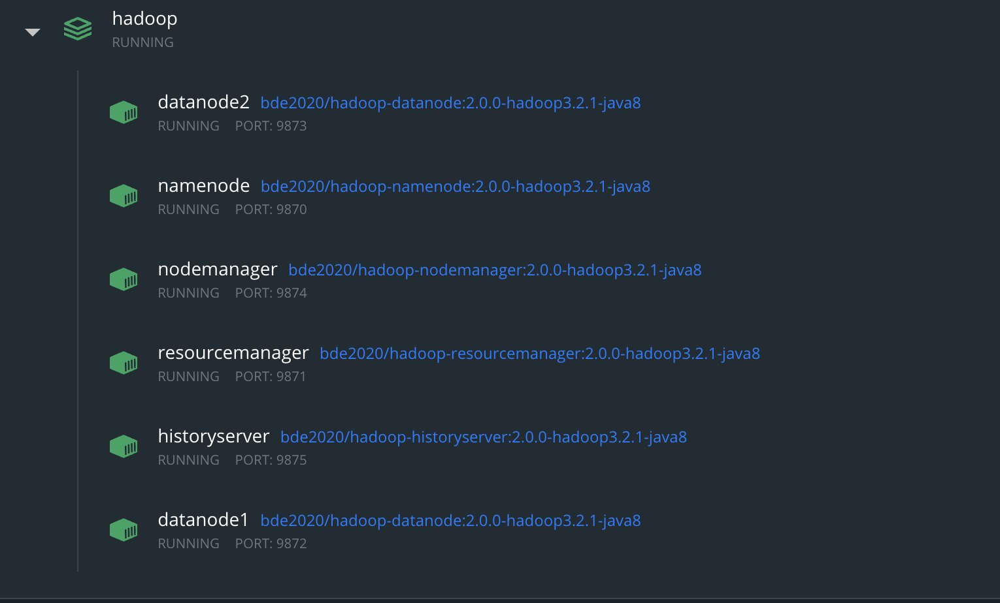

## Ćwiczenia z HDFSa

### 🏗 Instalacja

- zainstaluje [dockera](https://docs.docker.com/desktop/)
- wykonaj `docker-compose up -d`

### 🕸 Dostępne strony

- [name node](http://localhost:9870/dfshealth.html#tab-overview)
- [resource manager](http://localhost:9871/cluster)
- [history server](http://localhost:9875/applicationhistory)
- [node manager](http://localhost:9874/node)
- [data node 1](http://localhost:9872/datanode.html)
- [data node 2](http://localhost:9873/datanode.html)

### 💻 Łączenie się z shellem poszczególnych serwerów

```sh
docker exec -it <name> bash
```

Jako <name> należy wybrać jeden z kontenerów:

- namenode
- nodemanager
- resourcemanger
- historyserver
- datanode1
- datanode2



### 📩 Kopiowanie danych

```sh
docker cp <local path> <name>:<path>
```

### 💻 Komendy

- wyświetla aktualną wersję

  ```sh
  hadoop version
  ```

- pomoc

  ```sh
  hadoop fs -help [command]
  ```

- tworzy katalog

  ```sh
  hadoop fs –mkdir /path/directory_name
  ```

- listowanie katalogów

  ```sh
  hadoop fs -ls /path
  ```

- kopiowanie lokalnych plików

  ```sh
  hadoop fs -copyFromLocal <localsrc> <hdfs destination>
  ```

- pobieranie plików

  ```sh
  hadoop fs -copyToLocal <hdfs source> <localdst>
  ```

- wyświetlanie zawartości pliku

  ```sh
  hadoop fs –cat /path_to_file_in_hdfs
  ```

- przenoszenie plików

  ```sh
  hadoop fs -mv <src> <dest>
  ```

- kopiowanie plików

  ```sh
  hadoop fs -cp <src> <dest>
  ```

- usuwanie plików
  ```sh
  hadoop fs –rm <path>
  ```

### 📝 Ćwiczenia

<br/>

<details><summary>Stwórz plik `/data/f4.txt` zawierający napis `f4`</summary>
<p>

```sh
echo "f4.txt" | hadoop fs -appendToFile - /data/f4.txt
```

</p>
</details>

<br/>

<details><summary>Stwórz plik zbiorczy zawierający zawartość plików `f1.txt`, `f2.txt`, `f3.txt` i `f4.txt`</summary>
<p>

```sh
hadoop fs -getmerge hdfs:///data/f*.txt ./output.txt
hadoop fs -moveFromLocal /data/output.txt /data/output.txt

lub

hadoop fs -cat /data/f*.txt | hadoop fs -appendToFile - /data/output.txt
```

</p>
</details>

<br/>

<details><summary>Za pomocą hadoop'a stwórz lokalny folder</summary>
<p>

```sh
hadoop fs -mkdir file:///data/folder
```

</p>
</details>

<br/>

<details><summary>Wyświetl rozmiar plików w folderze `/data`</summary>
<p>

```sh
hadoop fs -du -h -v /data/

lub

hadoop fs -df -h /data
```

</p>
</details>

<br/>

<details><summary>Sprawdź czy pliki w folerze `/data` są zdrowe</summary>
<p>

```sh
hdfs fsck /data
```

</p>
</details>

<br/>

<details><summary>Zmień "replication level" na `2` dla pliku `/data/f1.txt`</summary>
<p>

```sh
hadoop fs -setrep -w 2 /data/f1.txt
```

</p>
</details>
